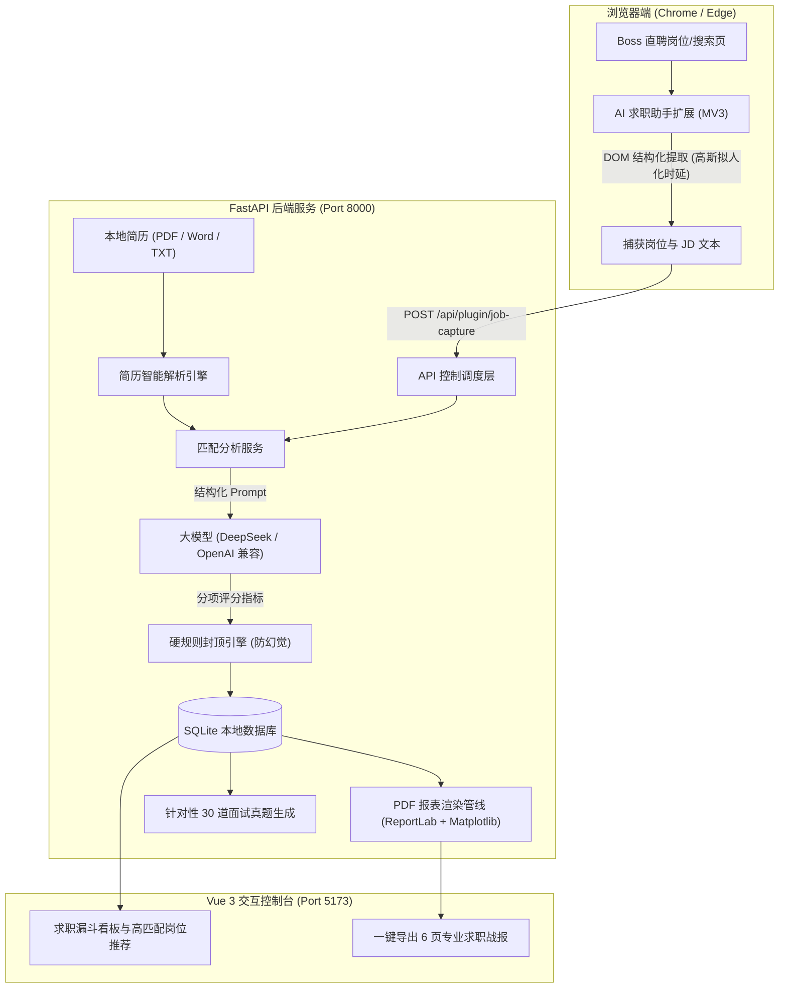

<div align="center">

# 🤖 AI Job Assistant (智能求职助手)

**全流程 AI 辅助求职利器 · 岗位智能匹配 · 浏览器无感抓取 · 面试真题冲刺 · 专业 PDF 战报生成**

<p align="center">
  <a href="LICENSE"></a>
  <a href="https://www.python.org/"></a>
  <a href="https://fastapi.tiangolo.com/"></a>
  <a href="https://vuejs.org/"></a>
  <a href="extension/"></a>
  <a href="https://docs.astral.sh/uv/"></a>
  <a href="CONTRIBUTING.md"></a>
</p>

[核心亮点](#-核心亮点) • [端到端工作流](#-系统全景与端到端工作流) • [快速开始](#-快速开始) • [浏览器插件](#-浏览器插件) • [匹配与封顶机制](#-评分机制与硬规则封顶) • [API 契约](#-系统核心交互与-api-契约) • [项目结构](#-项目结构) • [贡献指南](CONTRIBUTING.md) • [免责声明](docs/DISCLAIMER.md)

</div>

---

## 🌟 核心亮点

- 🎯 **5 级硬性防幻觉封顶引擎 (Anti-Hallucination Matching)**  
  不盲目相信大语言模型的单方打分。后端内置硬性规则安全网，当岗位技术方向不匹配、核心技能命中率过低或 JD 过短时，强制触发硬性分数封顶，彻底根除 LLM 的“高分谄媚与幻觉”。
- 🧩 **Boss 直聘浏览器协同插件 (Chrome / Edge MV3)**  
  在招聘详情页注入右下角轻量化交互面板。支持单岗位即时分析与整页批量扫描；内置 **15~45 秒拟人化高斯时延随机抖动**、单日沟通硬上限与滑块风控熔断保护，最大限度保障平台账号安全。
- 📊 **求职数据统计中心与专业 6 页 PDF 战报导出**  
  内置 ECharts 仪表板，动态追踪求职转化漏斗、技能缺口排行榜与 HR 活跃分布。底层基于 ReportLab 与 Matplotlib 动态嵌入矢量图表与系统中文字体，一键生成结构严谨、排版专业的 6 页求职复盘分析报告。
- 💡 **针对性 30 道定制面试真题冲刺**  
  针对标记“收到面试”的岗位，结合求职者简历的具体项目经历与岗位 JD 深度定向生成 30 道高频面试题（包含考查意图与参考答案要点），助您精准备战。
- ⚙️ **图形化大模型配置中心 (De-geekified Settings)**  
  告别手动翻找隐藏 `.env` 文件的极客门槛。Web 界面顶部右上角一键唤起模型设置，预置 **DeepSeek 官方 / 硅基流动 / 阿里百炼 / 本地 Ollama (免Key离线) / OpenAI** 等快捷厂商模板，支持 **一键连通性极速探测 (1-token ping)** 与 **免重启动态热生效**。
- ⚡ **现代化工程底座与零门槛体验**  
  后端全面接入 **Astral `uv`** 现代包管理（秒级依赖同步），前端基于 Vue 3 + Vite；支持 **一键免配置 Mock 演示模式**（无 Key 亦可畅玩体验全流程）与 **Docker Compose 一键容器化交付**。

---

## 🔄 系统全景与端到端工作流



---

## 🚀 快速开始

> 💡 **零配置开箱提示**：  
> 本项目默认开启 **高质量 Mock 模式**。无论是运行脚本还是 Docker，无需填写任何 API Key 即可启动并体验完整的 Web 界面、简历解析、岗位打分、图表看板与 PDF 报告导出！若需激活真实 AI，只需在 `backend/.env` 中配置 `DEEPSEEK_API_KEY`。

### 环境要求

- **Python**：>= 3.11（推荐安装 [Astral uv](https://docs.astral.sh/uv/)）
- **Node.js**：>= 18.0.0
- **浏览器**：Google Chrome 或 Microsoft Edge

---

### 方式一：一键脚本极速启动（推荐日常使用）

克隆项目后，无需在多个终端繁琐切换：

- **Windows 用户**：双击运行或在终端执行：
  ```cmd
  scripts\start_dev.bat
  ```
- **Linux / macOS / WSL 用户**：
  ```bash
  chmod +x scripts/*.sh
  ./scripts/start_dev.sh
  ```
> 脚本会自动检测端口、自动从 `.env.example` 初始化 `backend/.env`、自动并行拉起后端（端口 8000）与前端（端口 5173），并在退出时安全回收后台进程。

---

### 方式二：Docker Compose 容器化部署（开箱即用）

无需在本地配置 Python 或 Node.js 开发环境，基于容器一键交付：

```bash
# 启动前后端容器集群（后端已内置 Linux 中文字体支持）
docker compose up -d
```
- 前端 Web 界面：`http://localhost:5173`
- 后端 API 文档：`http://localhost:8000/docs`

---

### 方式三：手动分步启动 (Astral uv / pip)

#### 1. 后端服务

```bash
cd backend

# 初始化环境配置（默认使用 Mock 模式）
cp .env.example .env

# 使用 Astral uv 极速同步依赖并启动
uv sync
uv run uvicorn app.main:app --reload --port 8000
```
*(使用传统 pip 用户可执行：`python -m venv .venv && source .venv/bin/activate && pip install -r requirements.txt && uvicorn app.main:app --reload --port 8000`)*

#### 2. 前端服务

```bash
cd frontend

npm install
npm run dev
```

浏览器打开 `http://localhost:5173` 即可进入操作控制台。

---

### 🔑 接入真实大模型 (两种配置方式)

#### 方式 A：Web 界面图形化配置 (推荐 · 开箱免重启)

1. 启动项目后，在浏览器访问 Web 交互中心 (`http://localhost:5173`)；
2. 顶部导航栏最右侧点击 **`[⚙ 模型设置]`** 唤起配置中心；
3. **厂商一键预设**：下拉选择常用服务商（DeepSeek、硅基流动、阿里百炼、本地 Ollama 等），系统自动填入推荐端点与模型名；
4. **填入 API Key**：支持直达官方控制台超链接一键申请获取（本地 Ollama 完全免 Key 离线运行）；
5. 点击 **`[⚡ 测试连通性]`**：系统将发送超轻量 1-token 探测包并测量延迟，返回绿灯确认；
6. 点击 **`[保存并立即生效]`**：后端毫秒级热生效，**无需重启任何终端服务**。

#### 方式 B：环境变量文件配置 (.env 适合容器与无界面部署)

亦可直接编辑 `backend/.env` 文件配置对应环境变量：

```env
# 默认支持 DeepSeek 官方接口
DEEPSEEK_API_KEY=sk-your-api-key-here
DEEPSEEK_BASE_URL=https://api.deepseek.com
DEEPSEEK_MODEL=deepseek-chat
```

**主流支持端点与模型速查**：

| 模型提供商 | BASE_URL 示例 | 推荐模型 | 特点说明 |
|---|---|---|---|
| **DeepSeek (默认)** | `https://api.deepseek.com` | `deepseek-chat` / `deepseek-reasoner` | 官方高性价比 |
| **硅基流动 (SiliconFlow)** | `https://api.siliconflow.cn/v1` | `deepseek-ai/DeepSeek-V3` | 国内稳定加速，免费赠送14元额度 |
| **阿里百炼 (DashScope)** | `https://dashscope.aliyuncs.com/compatible-mode/v1` | `qwen-plus` / `deepseek-v3` | 阿里云高可用 SLA |
| **本地 Ollama** | `http://localhost:11434/v1` | `deepseek-r1:8b` / `qwen2.5:7b` | **完全免 Key / 离线私有化** |
| **OpenAI 官方** | `https://api.openai.com/v1` | `gpt-4o-mini` / `gpt-4o` | 标准兼容规范 |

---

## 🧩 浏览器插件

### 核心功能

| 功能模块 | 说明 |
|---|---|
| **单岗位深度分析** | 在 Boss 直聘详情页点击“发送到AI求职助手”，即时获取分项匹配结果 |
| **本页批量自动筛选** | 逐个点击当前页岗位卡片，自动提取 JD、并发分析并生成推荐清单 |
| **拟人化防封安全调度** | 处理每个岗位后引入 **15~45 秒高斯随机抖动时延**，模拟真实人类阅读行为 |
| **滑块风控与单日硬熔断** | 检测到滑块/验证码立即暂停；单日自动沟通设置 **20 次硬上限**，防平台封号 |
| **HR 活跃状态雷达** | 自动提取 HR 活跃标签（“刚刚活跃/今日活跃”等），计算综合推荐指数 |
| **面试真题触发** | 岗位状态标记为“收到面试”后，自动联动 AI 生成定制冲刺真题 |

### 快速安装

1. 打开浏览器扩展管理页面：
   - Edge: `edge://extensions/`
   - Chrome: `chrome://extensions/`
2. 开启右上角 **“开发人员模式” (Developer mode)**；
3. 点击 **“加载解压缩的扩展” (Load unpacked)**；
4. 选择项目中的 `extension/` 文件夹即可完成装载。

> 📖 插件详细使用指引与 DOM 选择器自定义维护，请参阅 [extension/README.md](extension/README.md)。

---

## 🎯 评分机制与硬规则封顶

系统采用 **“LLM 结构化语义理解 + 领域规则硬性封顶”** 的双重评分架构：

```
求职者简历 + 岗位 JD 
   │
   ▼
[LLM 语义提取与分项初评] ──► (技能 40分 + 经验 30分 + 学历 15分 + 潜力 15分)
   │
   ▼
[硬性规则安全网过滤] ──► (检查技术方向、核心技能命中率、JD 长度)
   │
   ▼
[综合推荐指数计算] ──► 匹配分 × 0.8 + HR活跃分 × 0.2
```

### 硬性封顶规则 (消除 LLM 幻觉)

| 触发条件 | 违背逻辑 | 最终分数上限 |
|---|---|:---:|
| `category_match = false` | 岗位技术方向不匹配 (如前端投算法) | **35 分** (不推荐) |
| `core_skill_hit_rate < 0.15` | 核心技术要点命中率极低 (< 15%) | **35 分** (不推荐) |
| `matched_core_skills` 为空 | 未命中任何岗位核心技术栈 | **40 分** (勉强匹配) |
| `core_skill_hit_rate < 0.30` | 核心技能命中率偏低 (< 30%) | **50 分** (部分匹配) |
| 岗位文本总字数 < 80 字 | JD 描述过于简陋，无法有效评估 | **45 分** (部分匹配) |

### 评级分段与投递建议

| 分数区间 | 匹配等级 | 投递建议 |
|:---:|:---:|---|
| **85 - 100** | 🌟 高度匹配 | 核心技能高度吻合，强烈建议立即沟通投递 |
| **70 - 84** | 👍 良好匹配 | 满足主体要求，建议投递 |
| **50 - 69** | ⚠️ 部分匹配 | 存在技能缺口或经验偏差，可选择性尝试 |
| **30 - 49** | ⚡ 勉强匹配 | 核心要求匹配度低，谨慎投递 |
| **0 - 29** | ❌ 不推荐 | 方向严重不符或核心要点未命中，不建议投递 |

---

## 📊 PDF 求职分析报告

进入 Web 控制台 `/dashboard` 页面，点击“导出求职报告”，系统管线将基于 ReportLab 自动生成一份专业的 6 页矢量分析报告。

| 页码 | 页面模块 | 核心内容 |
|:---:|---|---|
| **P1** | **封面** | 报告全称、求职者简历标识、扫描总数、生成时间 |
| **P2** | **求职总览** | 扫描岗位量、推荐岗位量、已沟通数、平均匹配度等 6 维关键指标卡 |
| **P3** | **图表页** | 匹配度分布柱状图 + 求职转化漏斗图 (Matplotlib 高清矢量图表) |
| **P4** | **Top 10 推荐** | 按“综合推荐指数”降序排列的高匹配且 HR 活跃岗位清单 |
| **P5** | **技能与市场洞察** | 技能缺口 TOP 10、推荐岗位方向分布、HR 活跃时段分布 |
| **P6** | **AI 总结与策略建议** | 基于全盘投递表现生成的针对性求职改进策略与备战建议 |

---

## 🔌 系统核心交互与 API 契约

本项目前后端及浏览器扩展之间采用标准的 RESTful JSON 协议进行通信。系统全面接入自动化交互式文档引擎：

- **Swagger UI 交互式文档**：启动后端后访问 [http://127.0.0.1:8000/docs](http://127.0.0.1:8000/docs)（支持在线发起请求、查看请求体 Schema 与响应结构）
- **ReDoc 契约文档**：访问 [http://127.0.0.1:8000/redoc](http://127.0.0.1:8000/redoc)

### 核心业务接口模块划分

| 业务模块 | 路由前缀 | 核心能力说明 |
|---|---|---|
| **简历服务** | `/api/resume` | 支持 PDF/Word/TXT 简历上传解析、MD5 内容判重与历史管理 |
| **匹配分析** | `/api/analysis` | 手动 JD 录入匹配、大模型要素提取与硬规则封顶打分 |
| **插件协同** | `/api/plugin` | 浏览器插件岗位捕获、即时匹配通信与投递/沟通状态流转 |
| **求职记录** | `/api/job-records` | 岗位生命周期管理、筛选漏斗聚合与定制 30 道面试题生成 |
| **统计与报表** | `/api/statistics` | 全盘求职数据大屏、HR 活跃分布与 6 页专业 PDF 报告管线导出 |
| **系统配置** | `/api/settings` | 大模型配置持久化、实时热重载与 1-token 连通性极速探测 |
| **智能 OCR** | `/api/ocr` | 招聘截图局部文字按需提取 (可选依赖) |

---

## 📂 项目结构

```
ai-job-assistant/
├── backend/                         # FastAPI 后端服务
│   ├── app/
│   │   ├── main.py                  # 应用入口、CORS 治理与中间件
│   │   ├── config.py                # 环境变量与应用配置
│   │   ├── database.py              # SQLite 连接与 Schema 自动迁移
│   │   ├── models.py                # SQLAlchemy ORM 数据持久化模型
│   │   ├── schemas.py               # Pydantic 请求/响应契约模型
│   │   ├── routers/                 # RESTful API 控制路由层 (含 /api/settings 配置中心)
│   │   ├── services/                # 核心业务逻辑服务层
│   │   │   ├── analysis_service.py  # 岗位匹配度分析与 5 级硬规则封顶引擎
│   │   │   ├── interview_service.py # 定制面试题生成与容错服务
│   │   │   ├── pdf_report_service.py# 6 页专业 PDF 报告渲染与图表管线
│   │   │   ├── plugin_service.py    # 插件岗位捕获与异步调度
│   │   │   ├── llm_client.py        # 大模型统一客户端 (支持免重启热重载)
│   │   │   ├── resume_parser.py     # 多格式简历解析器 (PDF / Word表格 / TXT)
│   │   │   ├── ocr_service.py       # 截图 OCR 识别服务 (按需动态加载)
│   │   │   └── job_parser.py        # 招聘页面文本结构化提取器
│   │   └── prompts/                 # 结构化 Prompt 提示词模板
│   ├── tests/                       # 后端 pytest 自动化测试套件
│   ├── pyproject.toml               # 项目配置与 Astral uv 依赖声明
│   ├── uv.lock                      # 跨平台依赖精确锁定文件
│   └── .env.example                 # 环境变量配置模板
├── frontend/                        # Vue 3 前端工程
│   ├── src/
│   │   ├── components/              # 公共可复用 UI 组件 (评分环/状态标签/模型设置弹窗)
│   │   ├── utils/                   # 通用工具模块 (防封号时延/导出/ECharts助手)
│   │   ├── views/                   # 核心业务页面 (看板/匹配/历史/岗位)
│   │   ├── stores/                  # Pinia 状态管理
│   │   └── api/                     # 后端 API 请求客户端封装
│   ├── package.json                 # 前端依赖配置
│   └── vite.config.js               # Vite 生产与开发构建配置
├── extension/                       # 浏览器扩展 (Manifest V3)
│   ├── content.js                   # 页面注入脚本 (拟人化时延与防封号熔断)
│   ├── background.js                # 扩展后台 Service Worker
│   └── popup.html / popup.js        # 扩展配置弹窗
├── scripts/                         # 跨平台工程自动化脚本
│   ├── start_dev.bat / .sh          # Windows / Linux 极速一键开发启动
│   └── verify_gauntlet.bat / .sh    # 全栈自动化质量门禁套件
├── docs/                            # 项目文档与资源说明
├── Dockerfile                       # 后端 Linux 容器镜像 (内置中文字体)
├── docker-compose.yml               # 一键容器编排部署文件
├── CONTRIBUTING.md                  # 社区贡献与开发规范指南
├── LICENSE                          # MIT 开源许可证
└── README.md                        # 项目主说明文档
```

---

## 🔒 隐私与本地数据安全

1. **纯本地化存储**：所有解析的简历文本、岗位数据与匹配历史仅保存在本地 SQLite 数据库（`backend/ai_job_assistant.db`）与本地目录（`backend/uploads/`），不上传至任何第三方云端；
2. **凭据安全**：API Key 仅存放于本地 `backend/.env`，已被 `.gitignore` 严格忽略，杜绝凭据泄漏；
3. **安全隔离**：浏览器插件通信严格限制在 `http://127.0.0.1:8000` 本地回环接口。

---

## 🤝 参与贡献与质量门禁

我们非常欢迎社区参与贡献！无论是提交 Issue、修复缺陷还是增加新功能。

为了保证代码库的一致性与稳定性，提交代码前请确保通过本地质量门禁套件验证（包含 Ruff 静态检查、全栈自动化单元测试与前后端生产构建）。

👉 详细的本地开发搭建、质量门禁使用与提交规范，请参阅 [CONTRIBUTING.md#5-质量门禁与本地验证-gauntlet](CONTRIBUTING.md#5-质量门禁与本地验证-gauntlet)。

---

## ⚖️ 免责声明 (Disclaimer)

本项目仅供个人求职辅助、学习研究与技术交流使用。使用者在利用本工具与招聘平台交互时，应严格遵守相关平台的服务协议与法律法规。严禁将本项目用于商业爬取、接口探测、批量营销骚扰或任何破坏网站正当运营秩序的行为。因使用本工具可能引发的第三方平台限制、账号受损或其它任何风险，均由使用者自行承担，与本项目开发者无关。

> 完整法律与反爬合规声明详见：[docs/DISCLAIMER.md](docs/DISCLAIMER.md)。

---

## 📄 开源协议 (License)

本项目采用 [MIT License](LICENSE) 开源许可证。
